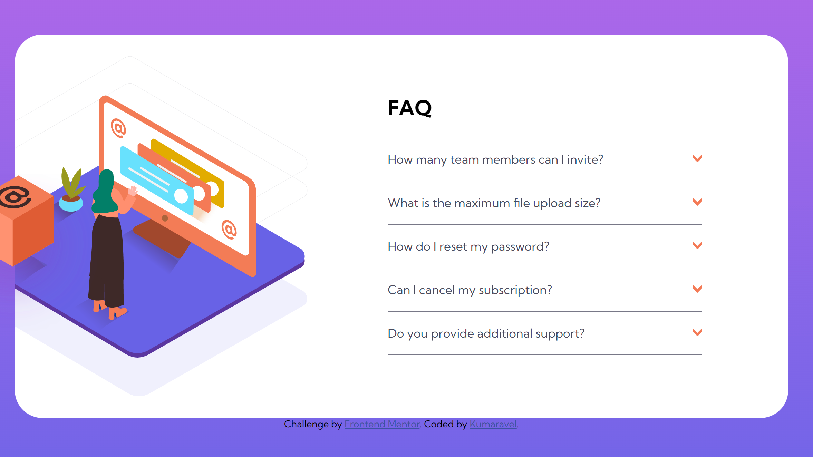
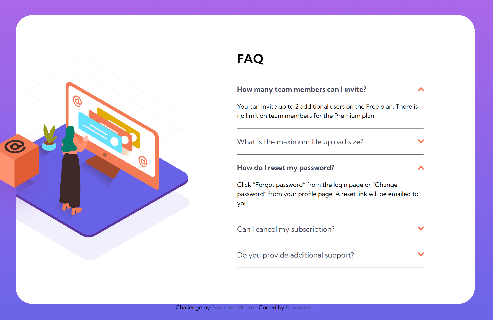
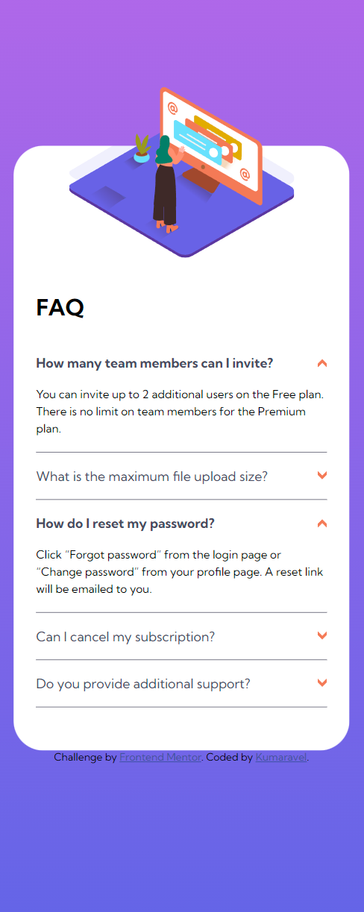

# Frontend Mentor - FAQ Accordion Card Solution

This is a solution to the [FAQ Accordion Card challenge on Frontend Mentor](https://www.frontendmentor.io/challenges/faq-accordion-card-XlyjD0Oam). Frontend Mentor challenges help you improve your coding skills by building realistic projects.

## Table of Contents

- [Overview](#overview)
  - [The Challenge](#the-challenge)
  - [Screenshot](#screenshot)
  - [Links](#links)
- [My Process](#my-process)
  - [Built With](#built-with)
  - [What I Learned](#what-i-learned)
  - [Continued Development](#continued-development)
  - [Useful Resources](#useful-resources)

## Overview

This is a simple accordion challenge from frontend mentor. It uses the following technologies, html, scss and vanilla javascript.

### The Challenge

Users should be able to:

- View the optimal layout for the component depending on their device's screen size
- See hover states for all interactive elements on the page
- Hide/Show the answer to a question when the question is clicked

### Screenshot





### Links

- Solution URL: [https://github.com/Kumaravel187/frontend-mentor-accordion](https://thriving-sunflower-e9b5fe.netlify.app/)

## My Process

I approached this challenge by following a guided tutorial that walked me through the process of creating a responsive FAQ accordion using HTML, SCSS, and JavaScript. While coding along with the tutorial, I made sure to explore and experiment with the concepts being taught. This allowed me to gain a deeper understanding of how each part of the accordion worked.

As I progressed through the tutorial, I went beyond the provided code and tried to customize the project further. This involved adjusting styles, refining layout choices, and experimenting with different interactions. Additionally, I referred to official documentation, such as MDN Web Docs and CSS-Tricks, to understand the concepts more comprehensively and apply them to my project.

By the end of the tutorial, I had successfully built a functional FAQ accordion that met the project's requirements.

### Built With

- HTML5 and Semantic Markup
- SCSS with Flexbox and Media Queries
- Vanilla JavaScript for Interactivity

### What I Learned

During this project, I learned how to create a responsive FAQ accordion using HTML, SCSS, and JavaScript. Some key takeaways include:

- Implementing a mobile-first approach in design and development
- Utilizing flexbox for layout and alignment of elements
- Enhancing user interactivity with JavaScript event listeners
- Managing content visibility through class toggling

I am most proud of figuring out how to use forEach and toggle, to maniuplate each accordion in the dom. I have added a code snippet below to show case my work.

```javascript
// Example JavaScript code I'm proud of
const toggleAccordion = (btnItem) => {
  btnItem.classList.toggle("open");
  btnItem.nextElementSibling.classList.toggle("open");
};

```

### Continued Development

While completing this project, I gained a solid understanding of responsive design and interactivity. In future projects, I plan to explore more complex animations for the accordion animation itself.

### Useful Resources

Coder Coder: https://www.youtube.com/watch?v=sr94O6Y5NEA&t=1915s
CSS-Tricks: Valuable CSS tips, tricks, and tutorials
JavaScript.info: In-depth JavaScript tutorials and explanations
